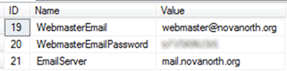
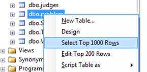
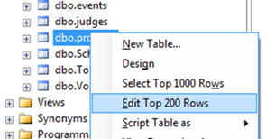
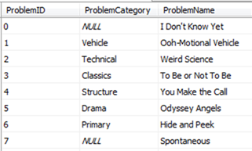
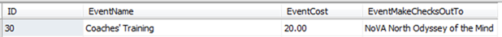
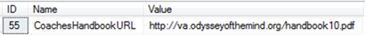
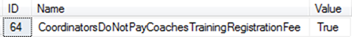

# Odyssey Registration Configuration

Version 1.0
Started 10/18/2011
Initially written by Robert Bernstein

## Links to other relevant documents

* [NoVA North Odyssey Web Site Configuration Information](./Website%20-%20Configuration%20Information.md)
* [Website - Fixing WordPress Theme Problems](./Website%20-%20Fixing%20WordPress%20Theme%20Problems.md)
* [Connecting to the SQL Server Database used for Registration](./Registration%20-%20Connecting%20to%20the%20SQL%20Server%20Database.md)

## Web Deploy Publishing Information

> [!note]
> This may no longer be valid as of 04/18/2026. See the [publish.ps1](../../publish/publish.ps1) script for the current publish capability.

| Setting | Value |
|---|---|
| Server / Service URL | https://w04.winhost.com:8172/MsDeploy.axd |
| Site Name | novanorth.org |
| Username | vaodysse |
| Password | Same as FTP password |

## Odyssey Registration Configuration

[Configuring Registration Open and Close Dates and Times](./Registration%20-%20Configuring%20Open%20and%20Close%20Dates%20and%20Times.md)

## Test Environment (vs. Production Environment)

There is also a database set up for testing the registration systems. Connect to the database with SSMS using the settings below.

Make sure you are making changes to the correct database; if you change the production database by accident, production users will immediately see those changes during their registrations.

| Setting | Value |
|---|---|
| Server Name | s06.winhost.com |
| Database Name | DB_12824_test |
| Authentication | SQL Server Authentication |
| Login | DB_12824_test_user |
| Password | (Available separately) |

The files associated with this test database are installed in /vaodysse/test (via FTP).

Here are the links to the test registration pages:

- <https://novanorth.org/test/CoachesTrainingRegistration>
- <https://novanorth.org/test/JudgesRegistration>
- <https://novanorth.org/test/TournamentRegistration>

## Webmaster E-mail Account

The <webmaster@novanorth.org> account is key to enabling both our WordPress website and our registration system to send e-mails on behalf of the webmaster. It must not be an alias and must be an account in order to authenticate to our SMTP server for outgoing mail. Please make sure not to change this account to an alias.

There is currently a <webmasters@novanorth.org> alias, i.e. plural, that is configured to forward to multiple e-mail accounts. Also, any mail sent to <webmaster@novanorth.org> is automatically forwarded to the webmasters alias and then deleted from the server.

The config table in the database contains three fields that enable the registration systems (i.e. Coaches Training, Judges, and Tournament Registration) to send e-mail messages to users. They are:

- WebmasterEmail
- WebmasterEmailPassword
- EmailServer

Their values should look similar to the following:

Note that if you change the WebmasterEmail to a different value, e-mails will not automatically get sent to the <webmasters@novanorth.org> alias, as described above. The new e-mail address would need to be configured in the Hosting company's control panel to forward mail to this alias.

## View the Current List of Problems

To display the current list of problem names provided to the user during registration, right-click on the "dbo.Problem" table in SQL Server Management Studio (SSMS) and choose "Select Top 1000 Rows". It should look like the following:

## Edit the List of Problems

To edit the current list of problem names provided to the user during registration, right-click on the "dbo.Problem" table in SQL Server Management Studio (SSMS) and choose "Edit Top 200 Rows". It should look like the following:

This will allow you to edit the "ProblemName" column in the "dbo.Problem" SQL Server table. It should look similar to the following:

## Changing the Amount Charged for Coaches Training

To change the amount charged for Coaches Training, edit the row in the dbo.Events table where the EventName is "Coaches' Training". It should look like the following:

Note that there may be additional columns in the table and you may need to scroll right to see all the columns.

## Adding or Removing References to the Coaches' Handbook

If you wish to include a link to the latest Coaches' Handbook from the Virginia state website in the registration e-mail and on the final page of registration, then fill in the Value field with the URL pointing to the Coaches' Handbook in the row within the config table where the Name is "CoachesHandbookURL". It should look similar to the following:

If you remove this link altogether, the entire reference to the Coaches' Handbook will be removed from the e-mail and on the final page of registration.

## Displaying whether Coordinators Pay the Coaches Training Registration Fee

If you wish to display a message stating that "School Coordinators do not pay the Coaches Training Registration Fee" on both pages of registration and in the e-mail sent upon success, then set the Value field to "True" in the row within the config table where the Name is "CoordinatorsDoNotPayCoachesTrainingRegistrationFee". It should look similar to the following:

## Accessing Coaches Training Registration

You can access the registration page at:

- <https://www.novanorth.org/registration/CoachesTrainingRegistration>

## Accessing Judges Registration

You can access the registration page at:

- <https://www.novanorth.org/registration/JudgesRegistration>

## Accessing Tournament Registration

You can access the registration page at:

- <https://www.novanorth.org/registration/TournamentRegistration>
