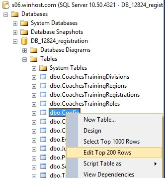
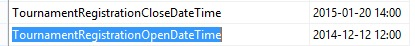

# Configuring Registration Open and Close Dates and Times

> [!note]
> These open and close instructions apply to Judges Registration, Tournament Registration, Coaches Training Registration, and Volunteer Registration

1.  Open SQL Server Management Studio (SSMS)[^1].

2.  Right-click on the dbo.Config table and select "Edit Top 200 Rows". It should look like the following:

3.  Find the rows with the names of "TournamentRegistrationOpenDateTime" and "TournamentRegistrationCloseDateTime". Your results should look similar to the following:

> [!note]
> Substitute "Judges", "CoachesTraining", or "Volunteer" for "Tournament" in "TournamentRegistrationOpenDateTime" or "TournamentRegistrationCloseDateTime" to modify any of those dates and times.

4.  Set the open and close dates and times to the appropriate values for this Odyssey season.

5.  If you want users to be notified that "Tournament Registration is coming soon" (or any of the other registrations mentioned above), then set the Value column to be a date/time after the current date/time.

6.  To see who has already registered for the tournament, right-click on the dbo.TournamentRegistration table and select \"Select Top 1000 Rows.\" The results will be displayed in the bottom half of the window.

7.  You may change the Judges Registration time frame in the same way using the rows containing the names "JudgesRegistrationOpenDateTime" and "JudgesRegistrationCloseDateTime".

8.  To see who has already registered as a judge, team, or volunteer for the tournament or for Coaches Training, right-click on the appropriate database table below and choose \"Select Top 1000 Rows.\" The results will be displayed in the bottom half of the window.
    1.  dbo.Judges
    2.  dbo.TournamentRegistration
    3.  dbo.CoachesTrainingRegistrations
    4.  dbo.Volunteers

> [!note]
> Although there are values in the dbo.Config table for Coaches Training Registration and for Volunteer Registration, they are not currently being used.

[^1]: See the [Registration - Connecting to the SQL Server Database.md](./Registration%20-%20Connecting%20to%20the%20SQL%20Server%20Database.md) document alongside this document or in our NoVA North Odyssey DropBox account.
