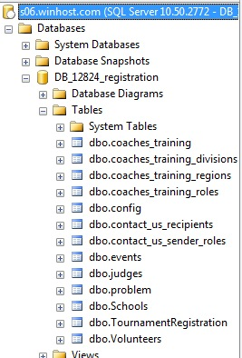

# Connecting to the SQL Server Database used for Registration

Please keep in mind that changes you make to the SQL Server database are immediately reflected in the registration pages.

In order to access the SQL Server database used by the Odyssey Registration System, you will need to download SQL Server Management Studio (SSMS) Express. There may eventually be a number of administration web pages so you don\'t have to use SSMS directly, but for the time being, this is the best way to edit the registration settings, run queries against the data, etc.

Download SSMS at:

- <https://aka.ms/ssms/22/release/vs_SSMS.exe>

Please see the System Requirements on the SSMS download page.

When you have SSMS installed, you can connect to the DB with the following information:

- From the File menu, select Connect Object Explorer.

| Setting | Value |
|---|---|
| Server Name | s06.winhost.com |
| Database Name | DB_12824_registration |
| Authentication | SQL Server Authentication |
| Login | DB_12824_registration_user |
| Password | (Available separately) |

If all goes well, you should see the following:

